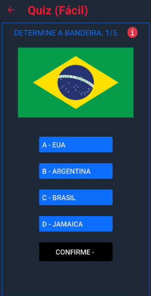

# QuizBandeira :world_map: :question:

O QuizBandeira é um desafio, onde o usuário deve acertar dentre 4 opções a bandeira correta.

## O projeto utiliza:

- React Native
- TypeScript
- Styled-Components
- React Navigation
- Zustand

## Imagens :arrow_down:

